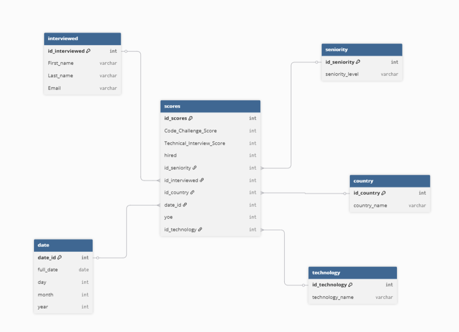

## Project Description

In this project, an ETL process was performed. Data was loaded into a data warehouse, and KPIs and visualizations were generated from them.
This was done to analyze relevant indicators regarding the hiring process of several candidates.

The pipeline follows a **star schema model** with a fact table for scores and multiple dimension tables:  
- **Fact Table:** `scores_fact_table`  
- **Dimension Tables:** `interviewed_table`, `country_table`, `seniority_table`, `technology_table`, `date_table`

## Project Structure
`````
Workshop1/
│
├── data/
│ ├── candidates.csv # Candidate dataset
│ └── candidatesdw.db # SQLite database generated by ETL
│
├── pics/
│ └── diagrama_estrella.png # Star schema diagram
│
├── src/
│ ├── etl.py # ETL script
│ └── query.py # Analysis queries and visualizations
│
├── .gitignore
└── README.md
`````

## Star Schema Diagram



## Explanation star Schema Diagram

- **Fact Table:** `scores_fact_table`  
  Contains all numeric measures and foreign keys to dimension tables. It includes metrics of interest to the company, such as `total hires`, `Code Challenge Score`, and `Technical Interview Score`, as well as other columns like `YOE` and `hired`.  
  Each row links to a candidate, their seniority, technology, country, and application date through foreign keys.

- **Dimension Tables:**  
  - `interviewed_table`: candidate information (First Name, Last Name, Email, unique ID).  
  - `country_table`: list of countries with unique IDs.  
  - `seniority_table`: seniority levels with unique IDs.  
  - `technology_table`: technologies with unique IDs.  
  - `date_table`: full date information (full_date, day, month, year) with unique ID.

- **Relationships:**  
  Each row in the fact table references one row in each dimension table via foreign keys.  
  This star schema allows easy aggregation and analysis, e.g., “total hires by technology” or “hires by year”.


# Requirements

- Python 3.10+  
- Libraries: `pandas`, `pandera`,`matplotlib`, `sqlite3` (built-in)

## How to run

1. Run the ETL script:

```bash
python src/etl.py 
```

The ETL will generate a SQLite database data/candidatesdw.db containing:

Dimension tables: interviewed_table, country_table, seniority_table, technology_table, date_table

Fact table: scores_fact_table

2. Run Analysis and Visualizations

```bash
python src/query.py
```

Generates KPIs and charts:

- Hires by Technology

- Hires by Year

- Hires by Seniority

- Hires by Country Over Years

- Hires by Years of Experience (YOE)

- Not Hires by Technology
